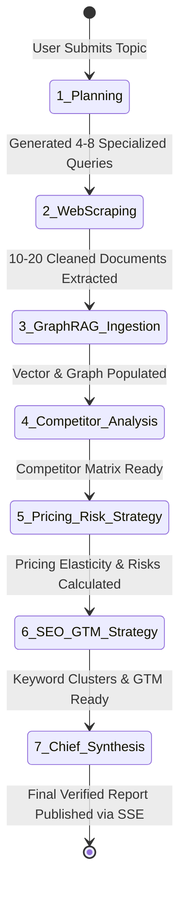
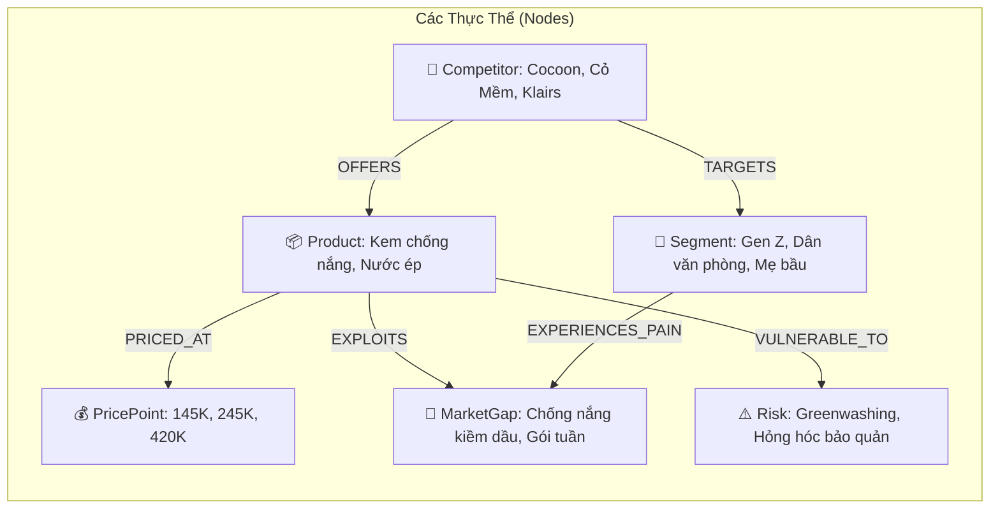
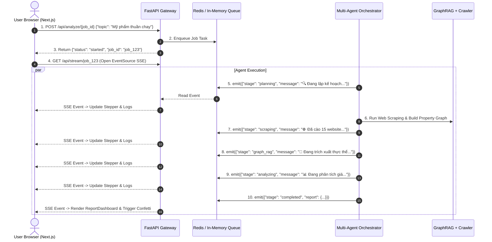
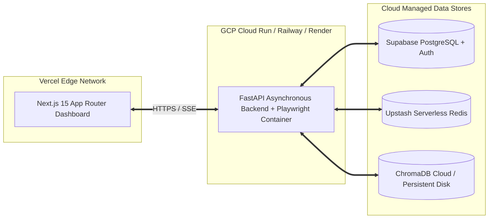

# KIẾN TRÚC HỆ THỐNG TOÀN DIỆN: AMA-SYSTEM
## (Automated Market Analysis System: Production-Grade Multi-Agent + GraphRAG)

---

## 1. TỔNG QUAN HỆ THỐNG & MỤC TIÊU THIẾT KẾ

### 1.1. Mục tiêu cốt lõi (Core Mission)
**AMA-System** là hệ thống tự động hóa nghiên cứu thị trường cấp doanh nghiệp (Enterprise-Grade Market Intelligence Platform), tích hợp kiến trúc **Multi-Agent** và **GraphRAG (Đồ thị tri thức kết hợp truy xuất tăng cường)** nhằm:
- **Tối ưu hóa thời gian**: Rút ngắn toàn bộ chu kỳ nghiên cứu thị trường từ **~8 giờ thủ công xuống còn 2–3 phút tự động**.
- **Độ tin cậy cao (Zero Hallucination)**: 100% dữ liệu về đối thủ, giá cả, từ khóa và xu hướng được trích xuất từ dữ liệu cào thực tế trên Internet thông qua đồ thị tri thức (Knowledge Graph Triples).
- **Trải nghiệm thời gian thực (Real-time Transparency)**: Cung cấp luồng phát sự kiện trực tiếp (**Server-Sent Events - SSE**) cho phép người dùng quan sát từng suy nghĩ, thao tác cào web và trích xuất thực thể của các AI Agent theo từng giây.

---

## 2. KIẾN TRÚC TỔNG THỂ (SYSTEM TOPOLOGY)

```mermaid
flowchart TB
    subgraph CLIENT_LAYER ["1. CLIENT & PRESENTATION LAYER (Next.js 15+ / Tailwind / Recharts)"]
        UI_INPUT[Input Topic & Strategy Parameters]
        UI_SSE[EventSource SSE Client Stream]
        UI_TIMELINE[Live Agent Progression Stepper & Terminal Logs]
        UI_DASHBOARD[Interactive Multi-Tab Intelligence Dashboard]
        UI_GRAPH[SVG / Canvas Knowledge Graph Explorer]
        UI_EXPORT[Export Engine: Markdown, JSON, PDF]
    end

    subgraph API_GATEWAY ["2. API GATEWAY & CONCURRENCY LAYER (FastAPI + Redis)"]
        FASTAPI_EP["FastAPI Router: /api/analyze, /api/stream/{job_id}"]
        AUTH_GUARD[Supabase Auth & Rate Limiter]
        REDIS_BUS[(Redis Pub/Sub & Queue / Async State Store)]
    end

    subgraph MULTI_AGENT ["3. AUTONOMOUS MULTI-AGENT LAYER (CrewAI / LangGraph)"]
        ORCHESTRATOR[Agent Workflow Orchestrator]
        A_PLANNER["Agent 1: Research Planner & Query Strategist"]
        A_CRAWLER["Agent 2: Web Scraper & Data Extractor"]
        A_KG["Agent 3: Knowledge Engineer (Triple Extractor)"]
        A_COMP["Agent 4: Competitor & Niche Analyst"]
        A_PRICE["Agent 5: Pricing & Risk Strategist"]
        A_SEO["Agent 6: SEO & Commercial Intent Specialist"]
        A_SYNTH["Agent 7: Chief Editor & Synthesis Agent"]
    end

    subgraph GRAPHRAG_ENGINE ["4. GRAPHRAG KNOWLEDGE RETRIEVAL LAYER (LlamaIndex + ChromaDB)"]
        SCHEMA_EXTRACTOR[SchemaLLMPathExtractor]
        subgraph STORAGE_STORES ["Hybrid Knowledge Storage"]
            VECTOR_STORE[(ChromaDB: Text-Embedding-004)]
            GRAPH_STORE[(Property Graph Store: NetworkX / Neo4j)]
        end
        HYBRID_RETRIEVER[Hybrid RAG Engine: Vector Sim + Multi-Hop Graph Traversal]
    end

    subgraph EXTERNAL_DATA ["5. EXTERNAL DATA SOURCES & CRAWLER SERVICES"]
        TAVILY_API[Tavily Search API / Serper SERP]
        PLAYWRIGHT_POOL[Headless Chromium Scraper (Playwright / Crawl4AI)]
        HTML_CLEANER[Trafilatura / BeautifulSoup Text Sanitizer]
    end

    subgraph PERSISTENCE ["6. PERSISTENCE & USER DATA (Supabase / PostgreSQL)"]
        DB_SESSIONS[(analysis_sessions)]
        DB_REPORTS[(market_reports)]
        DB_LOGS[(agent_execution_logs)]
    end

    %% Connectors
    CLIENT_LAYER <==>|HTTP / SSE| API_GATEWAY
    API_GATEWAY <==>|Job Triggers & SSE Events| MULTI_AGENT
    A_PLANNER --> A_CRAWLER
    A_CRAWLER <--> EXTERNAL_DATA
    A_CRAWLER --> A_KG
    A_KG <--> GRAPHRAG_ENGINE
    GRAPHRAG_ENGINE <--> A_COMP & A_PRICE & A_SEO
    A_COMP & A_PRICE & A_SEO --> A_SYNTH
    A_SYNTH --> DB_REPORTS
    API_GATEWAY <--> PERSISTENCE
```

---

## 3. THIẾT KẾ CHI TIẾT CÁC TẦNG HỆ THỐNG

---

### 3.1. Tầng 1: Multi-Agent Collaboration Workflow (Chi tiết 7 Tác Tử)

Hệ thống hoạt động theo mô hình **Sequential State Machine kết hợp Feedback Loop**:



| Agent | Vai Trò (Role) | Mô Hình LLM | Công Cụ (Tools) | Đầu Vào (Inputs) | Đầu Ra (Outputs) |
| :--- | :--- | :--- | :--- | :--- | :--- |
| **1. Planner Agent** | Chuyên gia Chiến lược Nghiên cứu Thị trường | Gemini 2.0 Flash | `QueryDecomposerTool` | Topic, Ngành, Ngôn ngữ | Bộ truy vấn SERP 4 chiều (Competitors, Pricing, Audience, Risks) |
| **2. Scraper Agent** | Chuyên viên Thu thập Dữ liệu Đa nguồn | Playwright + Tavily API | `TavilySearch`, `PlaywrightScraper`, `HTMLSanitizer` | Danh sách Search Queries | Mảng các văn bản Markdown sạch (>15,000 tokens) |
| **3. Knowledge Engineer** | Kỹ sư Tri thức & Trích xuất Thực thể | Gemini 2.0 Flash | `SchemaLLMPathExtractor`, `ChromaVectorStore` | Raw Documents | Property Graph (Nodes & Relations) + ChromaDB Embeddings |
| **4. Competitor Analyst** | Chuyên viên Phân tích Đối thủ & Định vị | Gemini 2.0 Flash | `GraphQueryEngine` | Graph Context (Đối thủ, Sản phẩm) | Bảng đối thủ trực tiếp/gián tiếp, SWOT, Thị phần ước tính, Market Gaps |
| **5. Pricing Strategist** | Chuyên viên Định giá & Quản trị Rủi ro | Gemini 2.0 Flash | `MathTool`, `GraphQueryEngine` | Bảng giá đối thủ, Chi phí đầu vào | Khoảng giá (Min, Median, Recommended, Premium), Gross Margin, 3 Tiers, Ma trận rủi ro |
| **6. SEO Specialist** | Chuyên gia Tối ưu Tìm kiếm & GTM | Gemini 2.0 Flash | `KeywordExtractorTool` | Nhu cầu người dùng, Điểm đau | Bộ từ khóa thương mại, Search Volume, Content Angles, Lộ trình GTM 3 pha |
| **7. Chief Synthesizer** | Trưởng ban Biên tập & Thẩm định Báo cáo | Gemini 2.0 Flash / 1.5 Pro | `PydanticSchemaValidator` | Toàn bộ kết quả từ Agent 1-6 | Báo cáo hoàn chỉnh chuẩn `MarketReport` JSON + Markdown |

---

### 3.2. Tầng 2: Kiến Trúc GraphRAG & Pipeline Tri Thức

GraphRAG vượt trội hơn Traditional Vector RAG nhờ khả năng **duyệt đồ thị đa bước (Multi-Hop Graph Traversal)** để tìm ra các mối quan hệ ẩn giữa **Đối thủ ↔ Sản phẩm ↔ Khoảng giá ↔ Nỗi đau khách hàng ↔ Rủi ro**:



#### Quy trình trích xuất & truy xuất (Extraction & Retrieval Flow):
1. **Extraction (Trích xuất Tri thức)**:
   - Sử dụng `LlamaIndex SchemaLLMPathExtractor` với Schema định nghĩa sẵn.
   - Trích xuất Triples `(Entity 1, Relationship, Entity 2)` kèm thuộc tính metadata.
2. **Dense Vector Indexing**:
   - Vector hóa từng đoạn nội dung bằng `models/text-embedding-004` (768 chiều).
   - Lưu trữ vào ChromaDB Collection `market_graph_rag`.
3. **Hybrid Query Engine (Truy xuất lai)**:
   - Truy vấn Vector để tìm các đoạn tài liệu tương đồng nhất về mặt ngữ nghĩa (Semantic Relevance).
   - Truy vấn Property Graph để bóc tách các đường đi (Graph Paths) giữa các đối thủ và khoảng giá.
   - Kết hợp kết quả bằng thuật toán **Reciprocal Rank Fusion (RRF)**.

---

### 3.3. Tầng 3: Tầng Dữ Liệu & Hợp Đồng Dữ Liệu (Data Contracts)

Mọi giao tiếp giữa **Backend ↔ Multi-Agent ↔ Frontend** đều tuân thủ 100% Data Contract theo Pydantic & TypeScript:

```json
{
  "id": "rep-20260816093000",
  "topic": "Thị trường mỹ phẩm thuần chay Việt Nam",
  "createdAt": "16/08/2026 09:30",
  "market_size_est": "~2,400 Tỷ VNĐ",
  "growth_rate": "18.5% CAGR",
  "executive_summary": "Tóm tắt cơ hội thị trường và bối cảnh...",
  "target_audience": [
    {
      "title": "Gen Z Ý Thức Sinh Thái",
      "desc": "Sinh viên, người mới đi làm 18-25 tuổi...",
      "pain_points": ["Ngân sách có hạn", "Sợ kem trộn giả mạo"]
    }
  ],
  "market_gaps": [
    {
      "title": "Kem chống nắng thuần chay nâng tone kiềm dầu",
      "opportunity": "Các dòng hiện tại bị bóng nhờn hoặc vón cục...",
      "priority": "Cao"
    }
  ],
  "swot": {
    "strengths": ["Nguồn nông sản Việt dồi dào"],
    "weaknesses": ["Hạn sử dụng ngắn"],
    "opportunities": ["Bùng nổ TikTok Shop / Shopee"],
    "threats": ["Chiến dịch phá giá của đối thủ ngoại"]
  },
  "competitors": [
    {
      "name": "Cocoon Vietnam",
      "type": "Trực tiếp",
      "positioning": "Thương hiệu thuần chay 100% hàng đầu",
      "strengths": ["Thương hiệu số 1", "Chứng nhận Leaping Bunny"],
      "weaknesses": ["Chưa mạnh về dòng đặc trị"],
      "price_range": "120.000đ - 380.000đ",
      "market_share_est": "38%"
    }
  ],
  "pricing": {
    "min_market_price": 120000,
    "median_market_price": 260000,
    "recommended_price": 245000,
    "premium_market_price": 580000,
    "unit": "VNĐ / sản phẩm",
    "pricing_logic": "Sweet spot của phân khúc Mass-Premium...",
    "margin_est": "62% - 70%",
    "tiers": [
      {
        "tier": "Starter Size",
        "price": 145000,
        "description": "Bản trải nghiệm 50ml",
        "features": ["Giảm rào cản thử nghiệm", "Tặng kèm sample"]
      }
    ]
  },
  "risks": [
    {
      "category": "Pháp lý",
      "risk_title": "Rủi ro Greenwashing & chứng chỉ",
      "risk_level": "Cao",
      "impact": "Mất uy tín cộng đồng",
      "mitigation": "Công khai COA kiểm nghiệm Quatest 3"
    }
  ],
  "seo_strategy": [
    {
      "keyword": "mỹ phẩm thuần chay việt nam",
      "intent": "Mua hàng (Commercial)",
      "search_volume_est": "Cao",
      "competition": "Cao",
      "content_angle": "Top 7 thương hiệu mỹ phẩm thuần chay tốt nhất"
    }
  ],
  "gtm_roadmap": [
    {
      "phase": "Giai đoạn 1: Thử nghiệm & Seeding (Tháng 1-2)",
      "timeline": "Tuần 1 - Tuần 8",
      "key_actions": ["Gửi 200 bộ kit Seeding", "Mở bán Pre-order"]
    }
  ],
  "graph_data": {
    "nodes": [
      { "id": "market", "name": "Mỹ Phẩm Thuần Chay VN", "category": "product", "size": 24 },
      { "id": "cocoon", "name": "Cocoon Vietnam", "category": "competitor", "size": 18 }
    ],
    "links": [
      { "source": "market", "target": "cocoon", "relationship": "DOMINATED_BY" }
    ]
  }
}
```

---

### 3.4. Tầng 4: Giao thức Truyền Phát Trực Tuyến (Server-Sent Events - SSE Protocol)

Khi người dùng nhấn **Phân tích**, hệ thống khởi tạo luồng bất đồng bộ:



---

## 4. MA TRẬN ĐÁNH GIÁ & XỬ LÝ SỰ CỐ (RELIABILITY & ERROR HANDLING)

| Kịch Bản Sự Cố | Rủi Ro Kỹ Thuật | Phương Án Xử Lý Tự Động (Resilience Mechanism) |
| :--- | :--- | :--- |
| **Website chặn cào (Cloudflare / 403 Forbidden)** | Mất dữ liệu nguồn của đối thủ | Fallback tự động sang Google SERP Snippets và bộ nhớ đệm Tavily Raw Text; chuyển sang site vệ sinh khác. |
| **LLM sinh lỗi định dạng JSON** | Lỗi render giao diện Frontend | Áp dụng **Pydantic Structured Output Enforcement** (`response_schema=MarketReport`), tự động retry tối đa 3 lần với temperature = 0.1. |
| **Đứt kết nối mạng giữa chừng (SSE Disconnection)** | Client mất trạng thái tiến trình | Frontend có cơ chế tự động kết nối lại (`reconnect with backoff`) và đồng bộ kết quả cuối từ database `analysis_sessions`. |
| **Trùng lặp thực thể đồ thị (Entity Resolution)** | Đồ thị bị phân mảnh (ví dụ: 'Cocoon' vs 'Cocoon VN') | Sử dụng thuật toán chuẩn hóa chuỗi và bước Entity Deduplication trong LlamaIndex Property Graph Extractor. |
| **Vượt ngân sách Token & Chi phí API** | Chi phí cao, độ trễ lớn | Dùng **Gemini 2.0 Flash** cho toàn bộ tác vụ cào, lọc và trích xuất thực thể; chỉ dùng **Gemini 1.5 Pro** cho báo cáo tổng kết cuối cùng. |

---

## 5. HẠ TẦNG TRIỂN KHAI PRODUCTION (DEPLOYMENT ARCHITECTURE)



---

## 6. KẾT LUẬN & BƯỚC TIẾP THEO

Kiến trúc trên đảm bảo:
1. **Độc lập hoàn toàn (Decoupled)** giữa Frontend và Backend.
2. **Tính mở rộng (Scalability)**: Dễ dàng thêm Agent mới (ví dụ: Financial Modeling Agent, Ad Copy Agent).
3. **Sẵn sàng cho Production (Production-Ready)** với đầy đủ Schema Validation, Error Fallback, Realtime SSE Streaming và Interactive Analytics UI.
